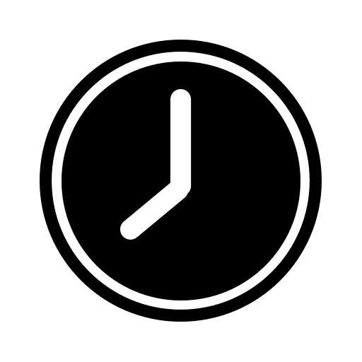
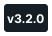

<h1 align="center"><b>Clock Web App</b></h1>

<b>Clock Web App</b> is an <b>Open Source Progressive Web App</b> designed to be <b>simple</b> and <b>easy</b> to use but <b>feature rich</b> offering <b>every feature and more</b> you'd expect from a Clock App.

<h2>Contents</h2>
<ol>
<li><a href="#1">How do I install Clock Web App?</a></li>
<li><a href="#2">Why use Clock Web App?</a></li>
<li><a href="#3">Will there be future updates?</a></li>
<li><a href="#4">Can I use the code?</a></li>
</ol>
<h2 id="1">How do I install Clock Web App?</h2>
<h3>Desktop</h3>

Follow the instructions bellow to download the ClockPWA:

<ol>
<li>Go to <a href="https://os-clock.web.app/">https://os-clock.web.app/</a></li>
<li>Click the three dots button</li>
<li>Click the Install App button</li>
</ol>
<h3>Android</h3>
<h4>Method 1</h4>

Follow the instructions bellow to download the ClockPWA:

<ol>
<li>Go to <a href="https://os-clock.web.app/">https://os-clock.web.app/</a></li>
<li>Press the three dots button</li>
<li>Press the Install App button</li>
</ol>
<h4>Method 2</h4>

Follow the instructions bellow to download the Clock.apk file:

<ol>
<li>Click the <a href="https://drive.google.com/u/0/uc?id=16VpLBZUMnh4tvo7MQJ0ul6Ev_5NbC2tD&export=download">download</a> link</li>

(You may need to sign in with your Google account)

<li>Follow your systems prompts until the App is installed</li>
</ol>
<h2 id="2">Why use Clock Web App?</h2>

Clock Web App can be used as an alternative to Clock apps developed by Big Tech companies. It is also perfect for use on slower systems as it is built in the Web and can also run on web based Operating Systems like ChromeOS.
 

Clock Web App also offers a wide host of customisation options that other apps simply don't have. You can hide UI elements you dont want, change the theme and accent colours and disable animations you dont want to see all the time. These features greatly improve the user experience as you can make the app your own.

<h2 id="3">Will there be future updates?</h2>

As of v3.2.0 Clock Web App has been sunsetted and will not recieve regular content updates anymore. However, this does not mean that the app will not occasionally recieve small maintenance updates to keep it up to date with modern Web standards.

<h2 id="4">Can I use the code?</h2>

This project is MIT licensed so you can install and use the source code however you wish wether that is too build off of the app and make a different version or if you're going to take a small section of the code and implement it into your own project.
